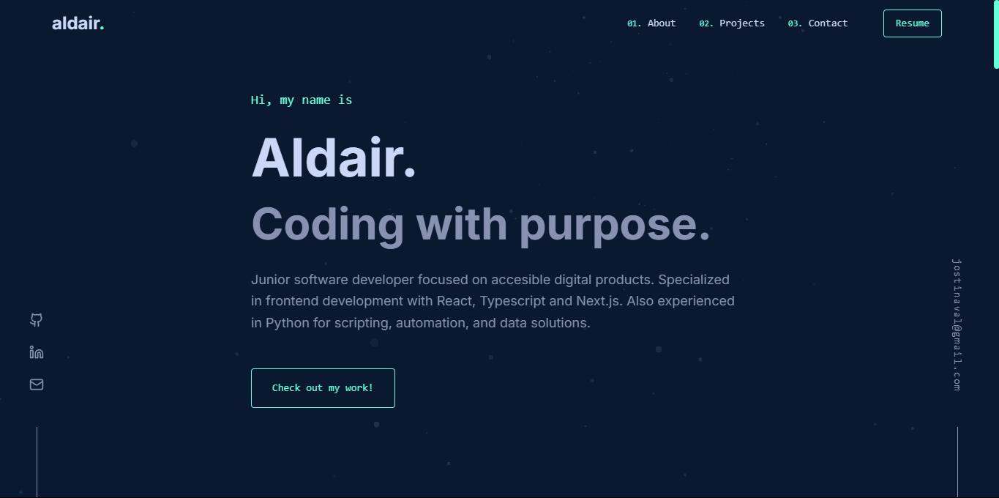

# Portfolio — Jostin Aldair Nava López

A personal portfolio built with Next.js, TypeScript, and Tailwind CSS. Showcases selected projects, skills, and contact information with a modern, animated, and accessible UI.



---

## ✨ Features

- **Modern stack:** Next.js (App Router), React, TypeScript, Tailwind CSS
- **Framer Motion** for smooth animations
- **Responsive** and mobile-first design
- **Accessible**: keyboard navigation, aria labels
- **Contact form** with EmailJS integration and toast feedback
- **Project cards** with hover and reveal animations
- **Dark color palette** for a focused UI

---

## 🚀 Getting Started

1. **Clone the repo:**
   ```bash
   git clone https://github.com/BeastAnniee/portfolio.git
   cd portfolio
   ```
2. **Install dependencies:**
   ```bash
   npm install
   # or yarn install
   ```
3. **Set up environment variables:**
   - Copy `.env.local.example` to `.env.local` and fill in your EmailJS keys:
     ```env
     NEXT_PUBLIC_EMAILJS_SERVICE_ID=your_service_id
     NEXT_PUBLIC_EMAILJS_TEMPLATE_ID=your_template_id
     NEXT_PUBLIC_EMAILJS_PUBLIC_KEY=your_public_key
     ```
4. **Run the development server:**
   ```bash
   npm run dev
   # or yarn dev
   ```
5. **Open** [aldairdev.vercel.app](https://portfolio-2woc3j0d4-beastanniees-projects.vercel.app/)

---

## 🛠️ Customization

- Edit your info and links in `src/components/Hero.tsx`, `Footer.tsx`, and `About.tsx`.
- Add or update projects in `src/components/Projects.tsx`.
- Update contact methods and social links in `Footer.tsx`.
- Change the 404 message in `src/app/not-found.tsx`.
- Styles are easily customizable via Tailwind classes.

---

## 🌐 Deployment

Deploy easily on [Vercel](https://vercel.com/) (recommended for Next.js):
- Push your repo to GitHub
- Import into Vercel and set your environment variables
- Deploy!

---

## 📦 Tech Stack
- [Next.js](https://nextjs.org/)
- [React](https://react.dev/)
- [TypeScript](https://www.typescriptlang.org/)
- [Tailwind CSS](https://tailwindcss.com/)
- [Framer Motion](https://www.framer.com/motion/)
- [EmailJS](https://www.emailjs.com/) (for contact form)

---

## 📄 License

This project is open source and available under the [MIT License](LICENSE).

---

## 🙋‍♂️ Contact

Feel free to reach out via the contact form on the site or email: jostinaval@gmail.com

---

## Credits
- Inspired by many amazing portfolios in the dev community
- Designed & coded by [Jostin Aldair Nava López](https://github.com/BeastAnniee)
